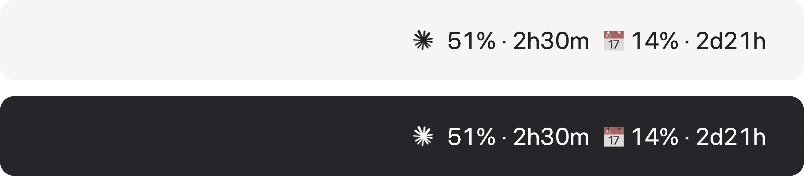

# One Tap Claude Cockpit

Your Claude Code usage, always visible in the macOS menu bar. Both limits, at a glance:
how much of the **5-hour session** you have burned, and how much of the **7-day week** —
each with a live countdown to its reset.



```
✳ 51% · 2h30m  📅 14% · 2d21h
  └ 5-hour session      └ 7-day week
```

The percentage turns **orange at 75%** and **red at 90%**, so you notice before Claude does.
Click it for reset times and the last sync.

## Why this one

No API keys. No token scraping. No polling of a private endpoint. No third-party
menu bar runtime (no xbar, no SwiftBar, no Python daemon).

Claude Code already hands its own status line command a JSON payload containing
`rate_limits.five_hour` and `rate_limits.seven_day` — percentage used and an absolute
reset timestamp. That is a documented, supported contract. This project simply listens to it:
a tiny shell hook parks the numbers in a file, and a ~180-line native Swift app
(`NSStatusItem`, AppKit, no dependencies) draws them.

The whole thing is one ad-hoc-signed 1-file app plus one shell script. It never talks to the
network, and nothing ever leaves your machine.

## Install

```bash
git clone https://github.com/miltonhit/one-tap-claude-cockpit-4mac.git
cd one-tap-claude-cockpit-4mac
claude "/install"
```

That is it. `/install` is a skill shipped in this repo: Claude checks your toolchain, builds
the app into `~/Applications`, registers the status line hook in `~/.claude/settings.json`
(backing the file up first), installs a LaunchAgent so the widget returns at every login, and
verifies it is actually running before telling you it is done.

Claude Code will ask you to trust the folder the first time, and to approve the build
commands. If you would rather not read a slash command, `claude` then `/install` inside the
session does the same thing.

Prefer no agent in the loop? `./install.sh` runs the exact same steps.
`/uninstall` and `./uninstall.sh` mirror it.

Then open a Claude Code session and send one message — the real numbers land with the first
API response. Until then the widget shows placeholders.

### Requirements

- macOS 13+
- Xcode Command Line Tools (`xcode-select --install`) — for `swiftc`
- `jq` at `/usr/bin/jq` (ships with macOS 13+)
- Claude Code on a Claude subscription (Pro/Max). API-key users have no subscription
  windows to show.

## How it works

```
Claude Code session
      │  status line JSON on stdin, on every render
      ▼
statusline.sh ──► ~/.claude/one-tap-claude-cockpit.json   (percent + resets_at)
                        │  polled every 5s
                        ▼
              OneTapClaudeCockpit.app  ──►  menu bar
```

The hook writes the snapshot and prints nothing, so your terminal stays clean.

The app is an `LSUIElement` agent: no Dock icon, no window, no login-item nag. Reset
countdowns are computed locally from the absolute `resets_at` timestamp, so they stay
correct even when nothing is running.

### Honest limitations

- **Numbers refresh only while a Claude Code session is live.** Idle, the widget holds the
  last reading — which is still correct, since usage does not grow while you are away.
- **Usage from claude.ai in the browser or the desktop app is not counted here.** It counts
  against the same limits, but only Claude Code reports them to the status line hook.
- After a window's `resets_at` passes, the widget shows `0%` until a session confirms the
  new figure.

## Already have a status line?

The installer will refuse to overwrite it and print instructions instead. To run both,
point the status line at this hook and let it call yours:

```json
{
  "env": { "COCKPIT_CHAIN": "/path/to/your/statusline.sh" },
  "statusLine": {
    "type": "command",
    "command": "~/Applications/OneTapClaudeCockpit.app/Contents/Resources/statusline.sh"
  }
}
```

`COCKPIT_CHAIN` receives the same JSON on stdin, and its output becomes your status line.

## Customizing

Everything tweakable lives at the top of `Cockpit.swift`:

```swift
let warningThreshold = 75      // orange
let dangerThreshold  = 90      // red
let separator = "  📅 "        // between the two windows
let refreshInterval: TimeInterval = 5
```

Change, then re-run `./install.sh`.

## Uninstall

```bash
./uninstall.sh
```

Removes the app, the LaunchAgent, the snapshot file, and the status line entry (only if it
still points at this project).

## The menu bar glyph

If the Claude desktop app is installed, the installer reuses its own menu bar glyph so the
widget matches the rest of your bar. If it is not, the app draws its own starburst in code.
No Anthropic artwork is redistributed in this repository.

Claude and the Claude logo are trademarks of Anthropic. This is an unofficial, unaffiliated
personal project.

## License

MIT — see [LICENSE](LICENSE).
